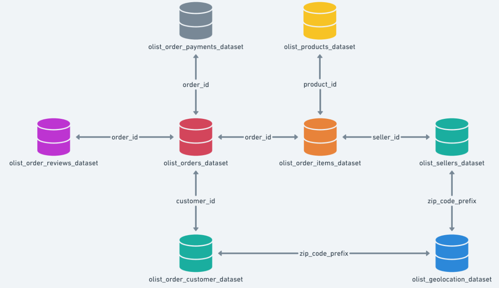
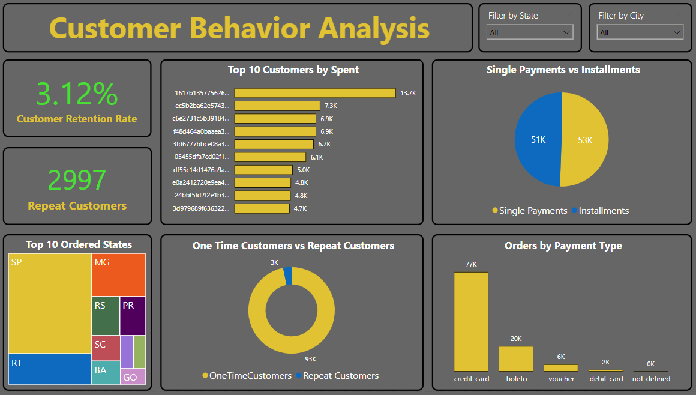

# 🛒 Olist E-commerce Data Warehouse Project

A full-fledged end-to-end SQL & Power BI project using real commercial data from Olist — a Brazilian multi-vendor e-commerce platform.

---

## 📊 Project Overview

This project analyzes over 100,000 orders made between 2016–2018 across multiple marketplaces in Brazil. It involves:
- Data import via Python & SQL INFILE
- Data cleaning & validation
- SQL-based analytics and optimization
- Power BI dashboards for visualization

---

## 🧱 Dataset Schema

Source: [Brazilian E-Commerce Public Dataset by Olist](https://www.kaggle.com/datasets/olistbr/brazilian-ecommerce)

---

## ⚙️ Steps Performed

### 1. Data Import Methods
- Connected MySQL to Python via python mysql connector for data import
- Used `LOAD DATA INFILE` for faster ingestion in SQL

### 2. Data Cleaning & Validation
- Checked for duplicates and nulls
- Ensured referential integrity (foreign keys)
- Handled inconsistent values

---

## 📈 Analysis Breakdown

### 🧮 3. Basic Metrics
- Total Customers, Orders, Product Categories
- Revenue, AOV, Items per Order, Largest Order

### 🧑‍🤝‍🧑 4. Customer Behavior Analysis
- Top spenders, Repeat vs One-time Customers
- Retention Rate, Preferred Payment Methods
- Top Locations, High-Value Customers

### 💸 5. Sales & Revenue Analysis
- Monthly Revenue Trends
- Top Categories & Products
- Profitability by Category

### 🚚 6. Delivery & Reviews Analysis
- Avg Delivery Time, Late Deliveries
- Review Score Distribution
- Correlation: Delivery vs Reviews

### 🛍️ 7. Seller Performance Analysis
- Top Sellers by Revenue
- Review Score Leaders
- High-Volume Sellers & Avg Delay

---

## ⚡ 8. Optimization Techniques
- Created **Indexes** for faster joins
- Designed **Views** for reusable logic
- Used **Stored Procedures** & **User-Defined Functions** for automation

---

## 📊 Power BI Dashboard

📍 Dashboard Includes:
1. Basic KPIs
2. Customer Behavior
3. Sales & Revenue
4. Delivery & Reviews
5. Seller Performance

## Dashboard Preview:

---

## 📌 Tools Used
- SQL (MySQL)
- Python (for data ingestion)
- Power BI (Visualization)
- Excel (Data sampling)

---

## 🧠 Learning Outcomes
- Advanced SQL querying & optimization
- Data modeling & ETL skills
- Business insights generation
- Dashboard storytelling using Power BI

---

## 📜 License
This project is open-source under the [MIT License](LICENSE).

---

## 👤 About the Author

**[Nikitha]**  
📫 Connect on [LinkedIn](https://www.linkedin.com/in/nikitha-chowdary-undavalli-9b783a221/)
📧 [Email](mailto:nikithachowdaryundavalli@gmail.com)  

---

## 🙌 Let's Connect!
Feel free to reach out if you have questions or want to collaborate!

